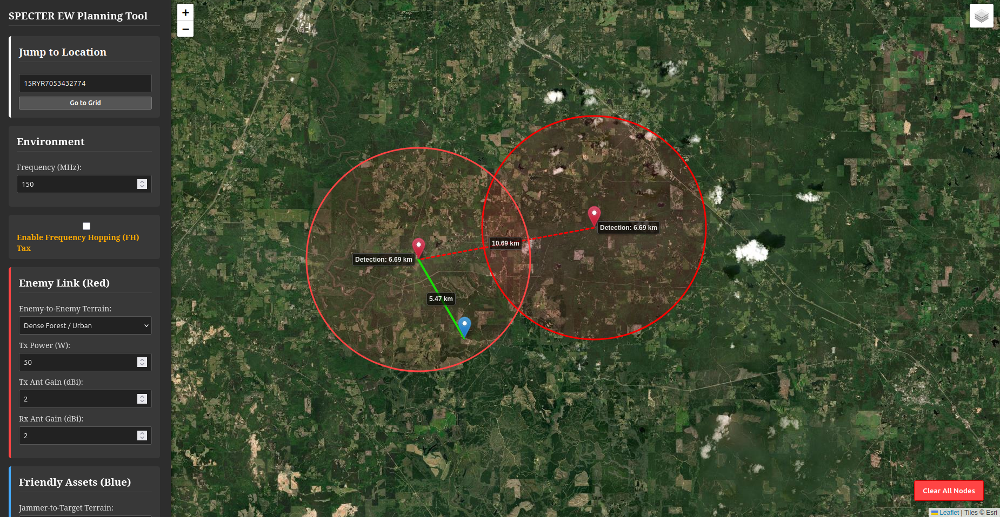

# Specter EW Planning Tool

A tactical Electronic Warfare planning tool for EA/ES mission analysis. Runs locally in the browser.



## Features

- **Jamming effectiveness (J/S margin)** — calculates jammer-to-signal ratio at the enemy receiver
- **Elevation-aware propagation** — queries the Open-Topo-Data API (SRTM 30m) to compute line-of-sight status and knife-edge diffraction loss (ITU-R P.526) for each jamming link; EA results include an LOS/NLOS badge and the diffraction penalty applied
- **Terrain-shaped detection rings** — ES sensing range is rendered as an azimuthal polygon rather than a uniform circle, shrinking in directions blocked by terrain; falls back to a circle if the elevation API is unreachable. Initial render takes ~4 seconds (36 bearings × 11 elevation samples, 4 API requests); subsequent renders of the same area are instant from cache
- **Jammer footprint** — toggle "Show Jammer Footprint" on any friendly node to display a terrain-shaped cyan polygon showing the jammer's effective coverage area per bearing, using the same reference sensitivity as ES detection rings. Directional antennas produce the expected teardrop lobe; omni antennas produce a roughly circular footprint. Falls back to a uniform circle if the elevation API is unreachable
- **Directional antenna support** — each node can be configured as omni or directional via its popup; enter boresight azimuth (True North) and half-power beamwidth. Effective gain is computed per bearing using a Gaussian beam model with a −20 dB sidelobe floor, affecting J/S margin, the shape of detection rings, and the shape of jammer footprints
- **Antenna height AGL** — each node has a configurable height above ground level (meters). Height is applied to the LOS/diffraction calculation so a mast-mounted antenna can correctly clear terrain obstacles that a ground-level node would not; path loss is still computed with a ground-level assumption
- **Configurable capture effect thresholds** — the J/S margin boundaries for No Effect, Warbling, and Complete Jamming are adjustable in the sidebar to match the target receiver type (analog vs. digital); link colors and workbench row colors update instantly when thresholds change
- **Range sanity warning** — a warning appears in the workbench when any jamming link or detection ring exceeds 50 km, flagging that Earth curvature is not modeled at those ranges
- **Clutter terrain types** — manual terrain category (free space, rural, light forest, dense forest) applies a frequency-dependent clutter loss on top of the elevation-derived diffraction
- **Frequency-hopping tax** — applies a configurable jamming penalty for frequency-hopping waveforms
- **Per-node naming and MGRS labels** — nodes can be renamed; permanent MGRS grid labels and elevation readouts are displayed above each marker on the map
- **Workbench** — place multiple red (enemy) and blue (friendly) nodes, link them individually or all at once, rename them, and remove links via the ✕ buttons in the link status table; click any row to highlight the corresponding link on the map
- **Node overlap analysis** — select two or more active detection rings to compute and highlight their common coverage area in yellow, with MGRS coordinates at each corner vertex
- **KML export** — exports the current map state to a `.kml` file from the Workbench. Includes enemy and friendly node placemarks, enemy comms links, jamming links (colored by J/S margin), ES detection ring polygons, and overlap zones. A second export option includes midpoint distance labels on all links and detection range labels on each ring, for use in Google Earth, ATAK, or any KML-compatible tool

## Requirements

- Python 3.12+
- Flask 3.0.0
- requests 2.28+
- shapely 2.0+
- flask-wtf 1.2+
- flask-limiter 3.5+

## Install and Setup

```bash
git clone https://github.com/XJabor/specter-ew.git
cd specter-ew
python3 -m venv venv
source venv/bin/activate        # Windows: venv\Scripts\activate
pip3 install -r requirements.txt
python3 app.py
```

Open `http://localhost:5000` in your browser.

## Usage

1. Select **Enemy Node** or **Friendly Node** and click the map to place them
2. Link enemy nodes individually or select **Link All Enemy Comms** in the Workbench
3. Left-click an enemy node and select **Show Detection Ring** if desired
4. Left-click a friendly node and select **Show Jammer Footprint** to visualize its coverage area (optional)
5. Left-click a friendly node, select **Link to Target**, then click the enemy node to target

Additional controls available from any node popup:
- **Rename Node** — set a custom label (shown in MGRS tooltips and the results table)
- **Antenna** — switch between Omni and Directional; if Directional, enter the boresight azimuth (° True North) and beamwidth (° HPBW)
- **Height AGL** — set the antenna height above ground level in meters (affects LOS/diffraction only)

Adjust platform parameters in the left sidebar and all links recalculate instantly.

## Field Deployment

The server binds to `0.0.0.0:5000`, making it accessible to other devices on the local network:

```
http://<host-ip>:5000
```

Debug mode is disabled. Use on a **trusted network only** (tactical LAN, isolated hotspot, etc.).

### Authentication

Password protection is configured via environment variables. Set these before starting the server:

| Variable | Required | Description |
|----------|----------|-------------|
| `APP_CREDENTIALS` | Optional | Enables login. Format: `user:pass` or `user1:pass1,user2:pass2` for multiple accounts. If unset, the app is open to anyone who can reach it. |
| `FLASK_SECRET_KEY` | Recommended | Signs session cookies. Generate a strong random value: `python3 -c "import secrets; print(secrets.token_hex(32))"`. If unset, a random key is generated each restart — every restart logs everyone out. |
| `SPECTER_HTTPS` | HTTPS only | Set to `true` when serving over TLS (e.g. behind nginx or on a PaaS like Digital Ocean App Platform). Enables the `Secure` flag on session cookies. **Do not set on plain-HTTP deployments** — browsers will silently drop the session cookie, causing an infinite login redirect. |

Example (Linux/macOS):
```bash
export APP_CREDENTIALS="alice:correcthorsebatterystaple,bob:hunter2"
export FLASK_SECRET_KEY="$(python3 -c 'import secrets; print(secrets.token_hex(32))')"
python3 app.py
```

> **Security note:** Password protection must be paired with HTTPS to be meaningful. Credentials set in `APP_CREDENTIALS` are transmitted in plaintext over HTTP. Always place the server behind a TLS-terminating reverse proxy (e.g. nginx, Caddy) or use a PaaS with managed TLS for any internet-facing deployment.

### Disclaimer
This application was built with AI assistance. The propagation models are conservative estimates. Use results at your own risk.
