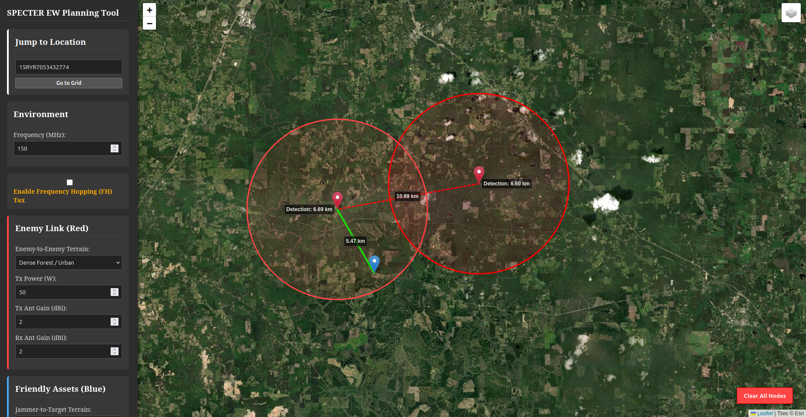

# Specter EW Planning Tool

A tactical Electronic Warfare planning tool for EA/ES mission analysis. Runs locally in the browser.



## Features

- **Jamming effectiveness (J/S margin)** — calculates jammer-to-signal ratio at the enemy receiver
- **Elevation-aware propagation** — uses local DTED Level 2 (30m) when available, falling back to the Open-Topo-Data API (SRTM 30m) for uncovered areas; computes line-of-sight status and dominant-obstacle knife-edge diffraction loss (ITU-R P.526) for each jamming link; EA results include an LOS/NLOS badge and the diffraction penalty applied. Requests to the free online service are queued at its one-per-second limit (with automatic retry if it still refuses one), so a scenario that fires many terrain calculations at once gets real terrain for every result instead of flat-circle fallbacks
- **Terrain-shaped detection rings** — ES sensing range is rendered as an azimuthal polygon rather than a uniform circle, shrinking in directions blocked by terrain; falls back to a circle if the elevation API is unreachable (the inspector and report flag this). Quality adapts to data source: **72 bearings × 25 samples** when local DTED L2 covers the area (near-instant); **36 bearings × 11 samples** when falling back to the API (~4 seconds, 4 API requests). Subsequent renders of the same area are instant from cache regardless of source
- **Jammer footprint** — toggle "Show Jammer Footprint" on any friendly node to display a terrain-shaped cyan polygon showing the jammer's effective coverage area per bearing, using the same reference sensitivity as ES detection rings. Directional antennas produce the expected teardrop lobe; omni antennas produce a roughly circular footprint. Falls back to a uniform circle if the elevation API is unreachable
- **Directional antenna support** — every emitter can be configured as omni or directional: red and blue nodes via their map popup, and EP systems and enemy extra systems via their workbench card. Enter boresight azimuth (True North) and half-power beamwidth. Effective gain is computed per bearing using a Gaussian beam model with a −20 dB sidelobe floor, affecting J/S margin, the shape of detection rings, the shape of jammer footprints, and the shape of every per-system ring
- **Antenna height AGL** — each node has a configurable height above ground level (meters). Height is applied to the LOS/diffraction calculation so a mast-mounted antenna can correctly clear terrain obstacles that a ground-level node would not, and also gates the propagation model — tx height ≥ 30 m enables COST-231 Hata and Two-Ray Ground Reflection for UHF frequencies. Receiver height counts too: a friendly sensor node's antenna height sets the receiver height of its sensor-coverage rings (and of enemy detection rings while it is the selected sensor); the sidebar's Generic Sensor Height, Reference Receiver Height (jammer footprints), and EP Enemy Rx Height cover the remaining cases. Heights below 1 m are treated as 1 m
- **Configurable capture effect thresholds** — the J/S margin boundaries for No Effect, Warbling, and Complete Jamming are adjustable in the sidebar to match the target receiver type (analog vs. digital); link colors and workbench row colors update instantly when thresholds change
- **Range sanity warning** — a warning appears in the workbench when any jamming link or detection ring exceeds 50 km, flagging that Earth curvature is not modeled at those ranges
- **Multi-band propagation routing** — terrain type (free space, rural, light forest, dense forest) applies calibrated corrections across every frequency band: Egli (1957) for VHF/UHF ground forces below 1 GHz (flat penalty of +8 dB light / +20 dB dense vs. rural); COST-231 Hata for elevated (≥ 30 m) stations on obstructed paths; Two-Ray Ground Reflection for elevated stations with line of sight; plane-earth two-ray loss plus the flat terrain correction for low antennas at 1–2 GHz; and plane-earth two-ray loss plus an ITU-R P.833 foliage/clutter model for SHF (>2 GHz) drone and ISM-band links (2.0 / 5.0 dB/GHz·km for light/dense terrain, plus a near-ground canopy penalty when antennas are below 5 m AGL). Every model is floored at free-space loss, and detection ranges are the exact inverse of the path-loss model. 1–2 GHz and SHF sensing distance is capped at the geometric radio horizon; VHF/UHF Egli propagates at 40 dB/decade with no artificial ceiling. SHF NLOS paths apply the terrain-blockage penalty, treating terrain as an opaque barrier. Terrain set to "Free space" uses pure free-space loss for airborne paths
- **Frequency-hopping tax** — applies a configurable, node-attached jamming penalty for frequency-hopping waveforms
- **Per-node naming and MGRS labels** — nodes can be renamed; permanent MGRS grid labels and elevation readouts are displayed above each marker on the map; all icon types have an inline MGRS input field in their popup — type a grid string and press Enter (or Go) to jump the icon to that location
- **Marker icons** — a third icon type (black) can be placed as a reference point; shows a permanent MGRS label, supports rename and move-to-MGRS, and has no RF or link features
- **EP (Electronic Protection) mode** — a separate workbench mode for friendly force analysis. Place EP nodes on the map, add named sub-systems manually or from Library templates, set each system's antenna to omni or directional, then click Calculate to generate terrain-aware detection rings for every system. Rings are color-coded per system from a fixed palette. Universal parameters (terrain type, enemy RX sensitivity) live in the sidebar. Switch between EA and EP modes with the EP button in the workbench header; all node types coexist when switching
- **Enemy extra systems** — each enemy node can carry additional named emitters beyond its own equipment, managed from the ENEMY SYSTEMS card in the EA workbench. Each system has its own frequency, power, gain, antenna (omni or directional with azimuth and beamwidth), and height, and renders its own color-coded terrain ring on Calculate. These systems are ring-only: they do not create comms links, J/S pairs, or sidebar equipment entries. Their rings are full participants everywhere else — selectable for overlap analysis, included in KML export, and covered by Center on Nodes
- **Calculation inspector** — click any jamming link, detection ring, sensor-coverage ring, enemy or EP system ring, or jammer footprint (or the ⓘ button next to it in the workbench) to see how the result was produced: the inputs, each intermediate value (power, antenna gain toward the target, EIRP, frequency-hopping tax, free-space and model path loss, terrain/foliage/diffraction terms, received power), the propagation model used and why, the final result, and warning flags. Warnings include online-only or missing terrain data, flat-circle fallbacks, results capped by the radio horizon, SHF blockage penalties, models used outside their calibrated range, results whose inputs have changed since they were calculated, and scenarios migrated from an older file format
- **Traceable reports** — Generate Report produces a print-friendly page (use the browser's Print → Save as PDF) covering the whole scenario: a map of nodes, links, and rings over the current satellite or street imagery, a node inventory, enemy comms links, J/S results, ES rings and jammer footprints, enemy and EP systems, overlap status, settings, the propagation models used, terrain-data coverage, every warning, calculation assumptions, limitations, a full per-result calculation breakdown, the app version, a timestamp, and a planning-estimate disclaimer. An optional marking line prints at the top and bottom. Reports are built only from explicitly selected planning data — never cookies, sign-in state, local file paths, or equipment notes
- **Model validation** — the propagation models are covered by automated tests whose expected values are worked by hand from the published formulas, plus a snapshot of model outputs across every branch that fails on any unexpected change, so physics changes cannot slip in unnoticed
- **Workbench** — place red (enemy), blue (friendly), and black (marker) nodes, manage Ops/Library/Builder/Scenario/About tabs, link enemy radios by matching frequency, rename nodes, and remove links via the X buttons in the link status table (or the Remove button in the inspector); click any row to highlight the corresponding link on the map, or its ⓘ button to explain the result. The Link Status, Enemy Systems, and Overlap Analysis sections each collapse via the caret in their header, so a long list in one section never buries the others
- **Node overlap analysis** — select two or more active detection rings to compute and highlight their common coverage area in yellow, with MGRS coordinates at each corner vertex. Enemy node detection rings and enemy system rings are listed separately and can be mixed freely in the same selection
- **Scenario save/load** — save the current planning state to a portable `.specter.json` file and load it later. Scenario files include nodes, links, node-attached equipment, enemy extra systems, EP systems, RF settings, active overlay intent, and map view. Autosave recovery is stored only in the current browser/device. While a saved scenario loads, a progress bar shows how many terrain-aware calculations remain
- **KML export** — exports the current map state to a `.kml` file from the Workbench. Includes enemy and friendly node placemarks, enemy comms links, jamming links (colored by J/S margin), ES detection ring polygons, enemy system rings in their own per-system colors, and overlap zones. EP mode has its own export covering EP nodes and their per-system rings. A second export option includes midpoint distance labels on all links and detection range labels on each ring, for use in Google Earth, ATAK, or any KML-compatible tool

### Equipment Library and Node Equipment

Equipment is attached to each red or blue node. Placed nodes store their own frequency, power, sensitivity, gain, antenna type, beamwidth, antenna height, and frequency-hop settings. Selecting a node loads that node's equipment into the left sidebar, and edits update the selected node.

The Workbench tabs are **Ops**, **Library**, **Builder**, and **Scenario**. Library templates can be placed as Enemy or Friendly nodes. Builder creates custom radio, receiver, or jammer node templates, which persist in browser `localStorage`, can be imported/exported as JSON packs, and are embedded into saved scenarios for portability.

Built-in Library templates are sourced civilian/commercial radios only. The app does not ship generic device templates, military radio templates, or jammer presets. User-created templates may include jammer assets. Radio frequency is editable after placement; receiver and jammer frequency fields are currently shown as locked reference/target context to avoid implying frequency-mismatch modeling that is not yet implemented.

## Requirements

- Python 3.12+
- Flask 3.0.0
- requests 2.28+
- shapely 2.0+
- flask-wtf 1.2+
- flask-limiter 3.5+
- rasterio 1.3+ *(local DTED and imagery support)*
- Pillow 9.0+ *(local imagery tile rendering)*
- PyJWT 2.4+ *(Clerk JWT verification for hosted deployments)*
- cryptography 41.0+ *(RSA key support for JWT)*

## Install and Setup

```bash
git clone https://github.com/XJabor/specter-ew.git
cd specter-ew
python3 -m venv venv
source venv/bin/activate        # Windows: venv\Scripts\activate
pip3 install -r requirements.txt
python3 app.py
```

Open `http://localhost:5000` in your browser.

Native Windows, Linux, and macOS executable builds are documented in
[`docs/cross_platform_executables.md`](docs/cross_platform_executables.md) and
[`docs/windows_exe.md`](docs/windows_exe.md). Tagged `v*` releases are built
natively for all supported platforms by GitHub Actions.

## Usage

### EA/ES Mode (default)

1. Select **Enemy Node**, **Friendly Node**, or **Marker** and click the map to place them
2. Link enemy nodes individually or select **Link Enemy Comms by Frequency** in the Workbench to auto-link same-frequency enemy radio nets
3. Left-click an enemy node and select **Show Detection Ring** if desired
4. Left-click a friendly node and select **Show Jammer Footprint** to visualize its coverage area (optional)
5. Left-click a friendly node, select **Link to Target**, then click the enemy node to target

Additional controls available from any node popup:
- **Rename Node** — set a custom label (shown in MGRS tooltips and the results table)
- **MGRS** — inline input field pre-filled with the node's current grid; edit and press Enter or Go to move the icon to that location
- **Antenna** — switch between Omni and Directional; if Directional, enter the boresight azimuth (° True North) and beamwidth (° HPBW) *(red and blue nodes only)*
- **Height AGL** — set the antenna height above ground level in meters; it affects LOS/diffraction and path loss, both when the node transmits and when a friendly node acts as the sensor for detection rings *(red and blue nodes only)*

Select a red or blue node to edit its node-attached equipment in the left sidebar. Links, rings, and footprints recalculate from the selected node values rather than a hidden global radio profile.

To model an enemy node that emits on more than one frequency, use the **ENEMY SYSTEMS** card for that node in the Workbench. Click **+ Add System** for a blank system or **Add From Library** to copy a template, set each system's frequency, power, gain, antenna, and height, then click **Calculate** to draw a color-coded terrain ring per system. Each system's **Antenna** can be set to Omni or Directional; Directional reveals Azimuth (° True North) and Beamwidth (° HPBW) and shapes that system's ring along the boresight, snapping the beamwidth to 90° on the switch from Omni so the shaping is visible. These rings are independent of the node's own detection ring and take no part in linking or jamming calculations, but they do appear in the Overlap Analysis checklist and in KML exports.

Moving a node invalidates its system rings — dragging the icon or jumping it to a new MGRS grid clears them, as does editing any system parameter. Click **Calculate** again to redraw. If the workbench gets crowded, use the caret in the **ENEMY SYSTEMS**, **LINK STATUS**, or **OVERLAP ANALYSIS** header to collapse that section.

### Inspecting Results

Click a jamming link line, any ring, or a jammer footprint on the map (with no placement or linking mode active) to open the **calculation inspector** beside the workbench. You can also click the **ⓘ** button on a jamming row in LINK STATUS or next to a calculated system in ENEMY SYSTEMS or an EP card. The inspector lists the inputs, each step of the link budget, the propagation model with a short explanation, the result, and any warnings. It refreshes as results recalculate and marks a result **stale** when its inputs have changed without a recalculation (for example, enemy system and EP rings, which only recalculate on **Calculate**). A jamming link's inspector also offers **Remove jamming link**; an enemy comms link's inspector lists the jamming results against it and offers **Remove link**. Press **Esc** or ✕ to close it.

### Reports

In the **Scenario** tab's REPORT section, optionally set a report title (defaults to the scenario name) and a marking line, choose whether to **Include map imagery** (the map's current base layer), and click **Generate Report**. The EXPORT sections of the EA and EP workbenches have the same button. The report opens in a new window; use **Print / Save as PDF**. If pop-ups are blocked, the report downloads as an HTML file instead. Results still calculating when you generate a report are left out, so wait for rings and links to finish first.

### Scenario Files

Use **Save Scenario** in the Workbench to download the current planning state as a `.specter.json` file. Use **Load Scenario** to restore a saved file, or **Save Copy** to export another copy without clearing the unsaved-change indicator. Loading recalculates every link, ring, and footprint; a progress bar at the top of the map counts the calculations. Areas without local DTED rely on the online elevation service, which allows one request per second, so a large scenario can take a minute or more to finish. Scenario files include node-attached equipment configs and custom Library templates needed to reopen the plan on another browser.

Scenario save/load is file-based by design. The app also keeps a browser-local autosave recovery snapshot for unsaved work, but that snapshot is stored only in the current browser profile on the current device. Hosted Clerk login does not upload scenarios or provide cloud sync; users who need to preserve or transfer work should download a `.specter.json` file.

### EP Mode

1. Click the **EP** button in the workbench header to switch to EP mode
2. Click **Place EP Node** and click the map to place a friendly node
3. In the workbench card, click **+ Add System** to configure a system manually, or choose a Library system and click **Add From Library** to populate the system name, frequency, power, gain, antenna type, beamwidth, and height
4. Set each system's **Antenna** to Omni or Directional. Directional reveals Azimuth (° True North) and Beamwidth (° HPBW) inputs and shapes that system's ring along the boresight; switching a system from Omni snaps its beamwidth to 90° so the shaping is visible
5. Click **Calculate** to generate terrain-aware detection rings for all systems on that node
6. Left-click the EP node icon on the map to rename or delete it

Set terrain type (default Rural / Open) and enemy RX sensitivity in the left sidebar. All node types (red, blue, black, EP) coexist — switching modes does not clear the map.

## Testing

```bash
python -m unittest discover -s tests      # backend, propagation models, API contract
node --test "tests/js/*.test.js"          # result model, inspector view model, reports (Node 18+)
```

The propagation tests compare every model branch against values worked by hand from the published formulas, and a golden snapshot pins model outputs so that any change to results fails loudly. After an intentional model change, regenerate the snapshot with `python -m tests.test_propagation_golden --regenerate` and review the diff.

## Local Geospatial Data

Specter can use local elevation and imagery files instead of (or in addition to) the online API, enabling offline operation and higher ring quality.

### DTED Elevation

Place DTED **Level 2** (`.dt2`, 30m) files in the `local_data/` directory using the standard military directory layout:

```
local_data/
  w094/
    n29.dt2
    n30.dt2
  w095/
    n29.dt2
```

Only Level 2 is indexed. Level 0 (900m) and Level 1 (90m) are intentionally excluded — their post spacing is too coarse for accurate diffraction calculations, and the fallback API (SRTM 30m) provides equivalent or better quality for areas without L2 coverage.

Free DTED L2 for CONUS is available from the [USGS National Map Downloader](https://apps.nationalmap.gov/downloader/) under *Elevation Products (3DEP) → 1/3 arc-second → GeoTIFF* (note: USGS 3DEP GeoTIFFs are not in DTED format — DTED L2 files must be sourced separately from NGA or similar).

### Imagery

Place GeoTIFF imagery (`.tif`, `.tiff`) anywhere under `local_data/`. Files are served as XYZ map tiles via an overlay layer in the layer control.

### Configuring the Data Directory

The default data directory is `local_data/` inside the app folder. To use an external drive or alternate path:

- **Environment variable** (recommended for fixed deployments): set `LOCAL_DATA_DIR=/path/to/data` before starting the app — the path is locked and cannot be changed via the UI
- **UI** (localhost only): a *Local Data Directory* panel appears in the sidebar when accessing from `127.0.0.1`; enter the path and click Apply, or click Rescan after adding new files

The configured path is persisted in `specter_config.json` across restarts.

## Field Deployment

The server binds to `0.0.0.0:5000`, making it accessible to other devices on the local network:

```
http://<host-ip>:5000
```

Debug mode is disabled. Use on a **trusted network only** (tactical LAN, isolated hotspot, etc.).

### Authentication

Specter supports two authentication modes depending on the deployment target.

#### Hosted / HTTPS deployments — Clerk

Public-facing deployments use [Clerk](https://clerk.com) for sign-in. Clerk handles the login UI and issues short-lived JWTs that the server verifies on every request — no server-side session storage required.

Clerk authentication does not add server-side scenario storage. Logging out and back in may offer same-browser autosave recovery, but only if the browser still has the local recovery snapshot. It will not restore work on another device or browser unless the user saved and loaded a `.specter.json` file.

| Variable | Description |
|----------|-------------|
| `CLERK_PUBLISHABLE_KEY` | Your Clerk production publishable key (`pk_live_...`). Setting this activates Clerk auth and disables the `APP_CREDENTIALS` path. The Frontend API URL is derived from the key automatically. |
| `CLERK_FRONTEND_API` | Optional override for the Clerk Frontend API URL. Only needed if automatic derivation from the publishable key fails (e.g. custom domain configurations). |
| `SPECTER_HTTPS` | Set to `true` when serving over TLS. Enables the `Secure` flag on session cookies. **Do not set on plain-HTTP deployments.** |

Setup steps:
1. Create a **production** instance in the [Clerk dashboard](https://dashboard.clerk.com) (development instances only work on `localhost`)
2. Add your domain (e.g. `specter-ew.com`) under Configure → Domains
3. Add the required DNS records at your DNS provider — set any CNAME records to **DNS only (grey cloud)** if using Cloudflare
4. Set `CLERK_PUBLISHABLE_KEY` in your server's environment and restart

#### LAN / HTTP deployments — APP_CREDENTIALS

Local network deployments use simple username/password authentication via environment variables.

| Variable | Description |
|----------|-------------|
| `APP_CREDENTIALS` | Enables login. Format: `user:pass` or `user1:pass1,user2:pass2`. If unset, the app is open to anyone who can reach it. |
| `FLASK_SECRET_KEY` | Signs session cookies. Generate one with: `python3 -c "import secrets; print(secrets.token_hex(32))"`. Required when `APP_CREDENTIALS` is set — without it, each server worker uses a different key, causing random logouts. |

Example:
```bash
export APP_CREDENTIALS="alice:correcthorsebatterystaple,bob:hunter2"
export FLASK_SECRET_KEY="$(python3 -c 'import secrets; print(secrets.token_hex(32))')"
python3 app.py
```

> **Security note:** `APP_CREDENTIALS` transmits passwords in plaintext over HTTP. For any internet-facing deployment, use Clerk (HTTPS) instead.

#### Localhost bypass

Requests from `127.0.0.1` or `::1` always bypass authentication — both Clerk and `APP_CREDENTIALS`. This allows local development without credentials.

### Disclaimer
This application was built with AI assistance. The propagation models (Egli, COST-231 Hata, two-ray ground reflection, free-space loss, ITU-R P.833 foliage) are empirical or theoretical approximations that give median planning estimates; real-world signal levels commonly vary by ±10 dB or more. Validate critical results in the field. Use results at your own risk.

## License

Copyright &copy; 2026 John E. Plaziak.

Specter EW is free software: you may redistribute it and/or modify it under the
terms of the [GNU Affero General Public License version 3](LICENSE), as published
by the Free Software Foundation. Modified versions made available over a network
must offer their corresponding source code as required by the AGPL.

This software is distributed in the hope that it will be useful, but WITHOUT ANY
WARRANTY; without even the implied warranty of MERCHANTABILITY or FITNESS FOR A
PARTICULAR PURPOSE. See the GNU Affero General Public License for details.

Versions released before this license change remain available under the license
included with those releases.

## Commercial Licenses

Organizations that prefer not to operate under AGPL-3.0 may obtain a separate
commercial license. For pricing and licensing inquiries, contact
[licensing@specter-ew.com](mailto:licensing@specter-ew.com).

## Contact

For general inquiries, contact
[contact@specter-ew.com](mailto:contact@specter-ew.com).
